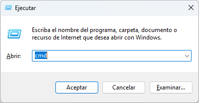
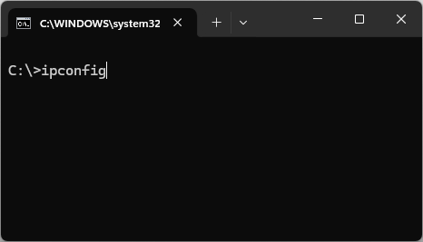

# Usando RVNC

Podemos acceder a URSIM desde la interfaz web [`http://localhost:6080/vnc.html`](http://localhost:6080/vnc.html) o tambien podemos acceder a URSIM desde cualquier cliente VNC, uno de los más usados es el RealVNC el cual tiene clientes para sistemas operativos móviles como Android y iOS. 

{: class="logo img-center"}

- Enlace para la Google Play Store [aquí](https://play.google.com/store/apps/details?id=com.realvnc.viewer.android&hl=es_CO)
- Enlace para la App Store [aquí](https://apps.apple.com/es/app/realvnc-viewer-remote-desktop/id352019548)

La versión en iOS permite la interacción con el URSIM usando las capacidades _touch_ del iPhone o del iPad. La versión de Android está limitada a interacción tipo _mouse_. 

Para conectarnos con el URSIM necesitaremos tener conectados en la misma red wifi, el PC donde corre URSIM y el dispositivo con RealVNC. Luego de esto necesitaremos conocer la IP del PC en dicha red, para conseguir la presionaremos en el teclado las teclas `window`+`R` o `🪟`+`R` .

{: class="img-center"}

Escribimos `cmd` y le damos al botón `Aceptar`, en ese momento se abrira una ventana terminal, en donde escribiremos `ipconfig` y presionaremos `Enter`:

{: class="img-center"}

Buscaras en el terminal algo similar a lo que mostramos a continuación:

```txt
Adaptador de LAN inalámbrica Wi-Fi:

   Sufijo DNS específico para la conexión. . : wifi
   Vínculo: dirección IPv6 local. . . : fe80::c848:ffa2:aeb9:e1d%24
   Dirección IPv4. . . . . . . . . . . . . . : 192.168.1.20
   Máscara de subred . . . . . . . . . . . . : 255.255.255.0
   Puerta de enlace predeterminada . . . . . : 10.10.54.1
```

En el ejemplo anterior buscaremos el adaptador de `LAN inalámbrica Wi-Fi` y de ahí tomaremos el valor de la `Dirección IPv4` es este caso `192.168.1.20`. Estos 4 números separados por punto los necesitaremos para la conexión del dispositivo con RealVNC al URSIM. 

A continuación mostramos un video de conexión desde un iPad: 

<p><iframe class="img-center" width="500x" height="350px" src="https://www.youtube.com/embed/Bfo220bfreo?si=OFBDKXna1Vu6ki3q" title="YouTube video player" frameborder="0" allow="accelerometer; autoplay; clipboard-write; encrypted-media; gyroscope; picture-in-picture; web-share" referrerpolicy="strict-origin-when-cross-origin" allowfullscreen></iframe></p>