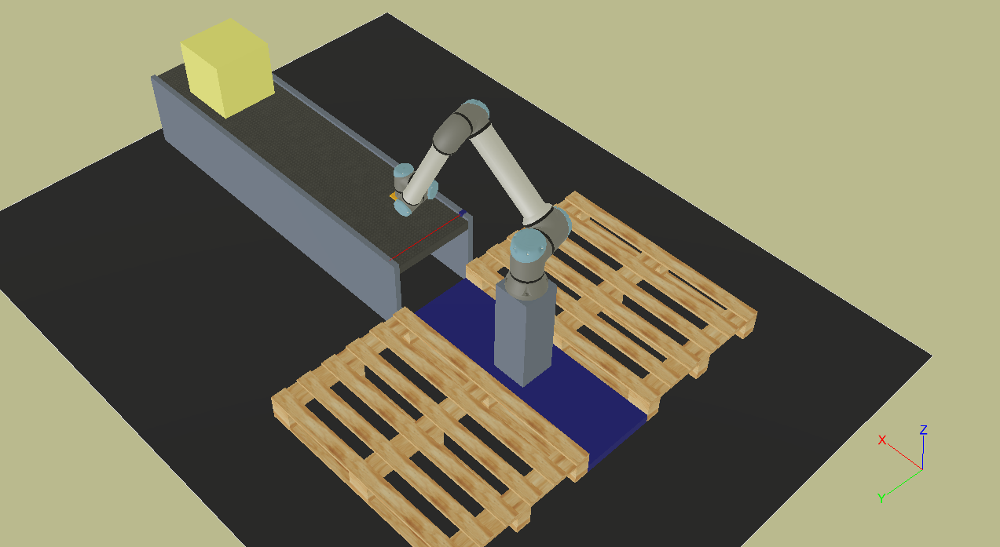

# Palletizado con un UR10e

El entorno de _palletization-single-ur10e_ es un entorno que nos permite iniciarnos en el mundo de los manipuladores robóticos. A continuación se presenta una imagen del entorno. 

{: class="img-center"}

Para abrirlo simplemente abriremos Webots y buscaremos el archivo desde Webots: 

```txt
..\palletization-single-ur10e\worlds\simulation.wbt
```

Al abrir el archivo se empezará a correr la simulación. **IMPORTANTE** tener el contenedor de URSIM corriendo. 

## Entradas y Salidas

Las entradas y salidas esta configuradas ya en el archivo de instalación `simulation.installation` y son las siguientes:

|I/O|Registro|Nombre|Descripción|
|:------------:|:------:|:----:|:----------|
|entrada|GPbi[64]|infeed_laser|detector de objetos en la banda de entrada|
|salida|DO[0]|infeed_on|activación de banda de entrada, banda de piezas|
|salida|TO[0]|gripper|activación de la pinza de vacion, **low** para no succionar, **high** para succionar|
|salida|AO[1]|outfeed_speed|control de la velocidad de la banda de salida*|

\* puede ser controlada en voltaje 0-10V o en corriente 0-4mA.

## Pasos para usar este simulador

1. Abrir un terminal en la carpeta del proyecto `palletization-single-UR10e`.
2. En dicho terminal correr el comando `docker compose up -d` (En _Windows_ debemos tener docker desktop corriendo).
3. Navegar a la url [http://localhost:6080/vnc.html](http://localhost:6080/vnc.html)
4. Abrir el simulador `worlds/simulation.wbt` y correr la simulación.
5. Programar el programa en URSim Polyscope.
6. Para finalizar en el terminal correr el comando `docker compose down`.